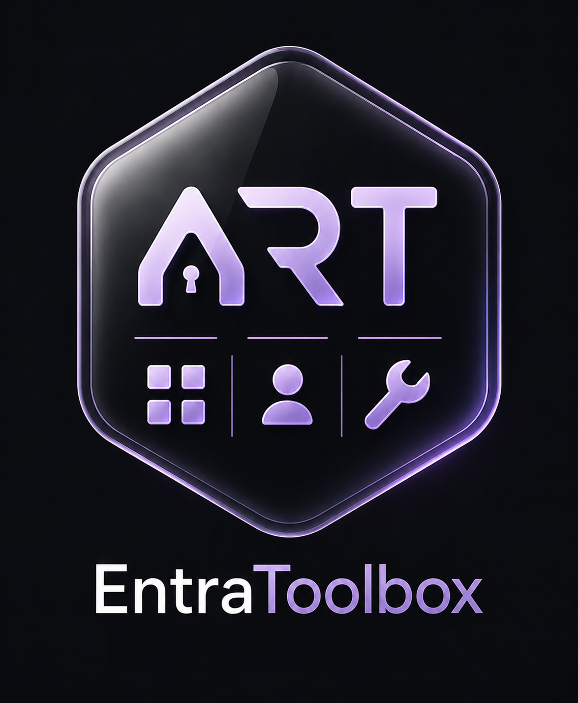

  

# Entra Toolbox

> Built for my own IT workflow managing school Entra ID tenants. Published for reference — may not suit your use case.

Desktop app for Entra ID (Azure AD) management. No Azure app registration required.

## Tools

| Tool | Description |
|------|-------------|
| **Year Group Passwords** | Bulk password reset by department with dry-run preview and CSV export |
| **User Password Reset** | Single-account password reset |
| **Bulk UPN Change** | Move cloud-only users to a different verified domain |
| **Immutable ID** | Assign or remove `onPremisesImmutableId` on cloud-only accounts |
| **Last Device** | Intune device lookup by user or device name, stale device filter |
| **Sign-In Logs** | Last 50 sign-ins for any user |
| **Group Copy** | Copy all group memberships from one user to another |
| **Teams Provisioning** | Create a Class or Standard team and populate members |

Multi-tenant. Token cache is persisted and encrypted — sign in once, stay connected.

## Download

Grab the latest release for your OS from the [Releases](https://github.com/ydap1/arts-entra-toolbox/releases) page.

## Permissions

Uses the Microsoft Intune PowerShell public client ID — no app registration needed. Scopes requested at first sign-in:

`User.ReadWrite.All` · `DeviceManagementManagedDevices.Read.All` · `AuditLog.Read.All` · `GroupMember.ReadWrite.All` · `Team.Create` · `TeamMember.ReadWrite.All`

## License

MIT
